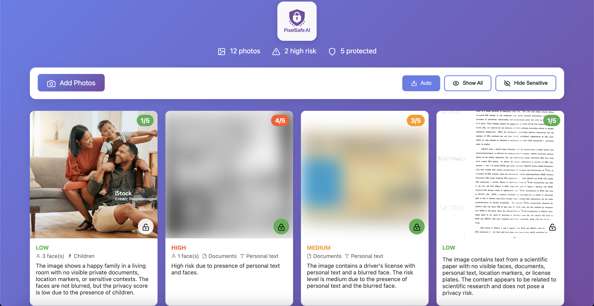
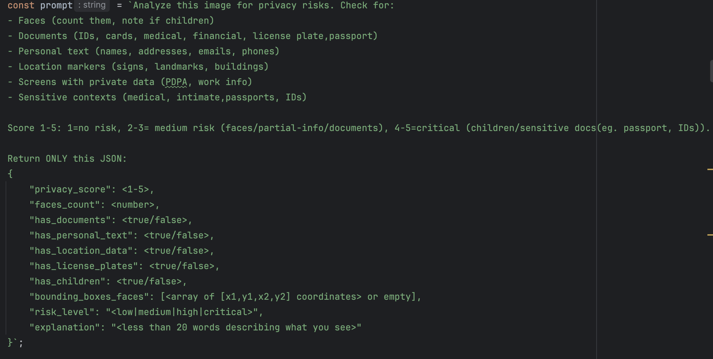
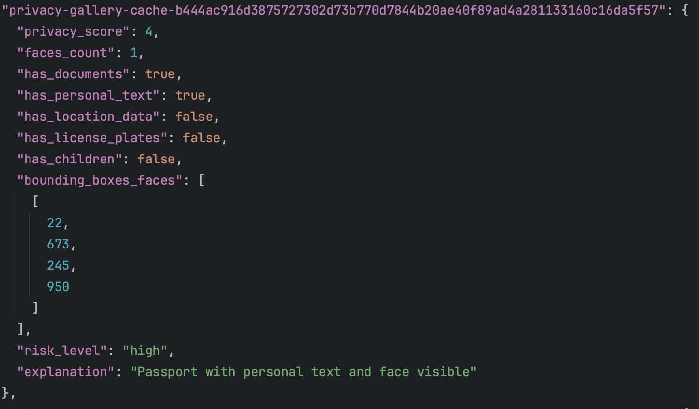

<div align="center">
    
</div>

PixelSafe AI Gallery demonstrates how AI can protect/analyse your sensitive photos without compromising privacy and security. Using lightweight, locally-run AI model (`Qwen2.5VL-3B`), it `detects faces, documents, and personal information` in images, processing happens on YOUR device offline, never in the cloud.

This `proof-of-concept` idea combines real-time privacy risk detection with immediate protection features (blur, encrypt), showing that powerful AI assistance doesn't require sacrificing data privacy. Built with `Python/Ollama` backend and vanilla JavaScript, it's designed to run on everything from laptops to phones.
The key innovation: True zero-trust photo protection where your images never leave your device, yet you still get intelligent privacy analysis powered by state-of-the-art AI.

## **Installation/Requirements:**
* Ollama: Follow instructions at https://ollama.com or:
```bash
pip install ollama
```
* Qwen2.5-VL-3B-Instruct Model: Download via Ollama with 
```bash 
ollama pull qwen2.5vl:3b
```
* Clone repo then run server.py: http://localhost:3000/
```bash
python server.py 
```
* Change and Edit images in `data/pictures` folder or Add in Image for Analysis

## **Problem Statement:**
In the age of social media and cloud storage, it is easy to lose track of the sensitive information contained in our photos. Personal information such as faces, documents, and location data can be inadvertently shared, leading to privacy risks. This project aims to provide a tool that helps users to identify and protect their privacy by analyzing images for sensitive content and providing easy-to-use tools for redacting or protecting this information.

**Development Tools:**

*   **Backend:** `Python, Flask`
*   **Frontend:** `Vanilla JS, HTML, CSS`
*   **AI Model:** `Qwen2.5-VL-3B-Instruct`
*   **AI Framework:** `Ollama`

**APIs Used:**
*   **`Ollama API:`** The application uses the Ollama API to interact with the local AI model. The frontend sends a request to the backend, which then proxies the request to the Ollama server.
*   **`Flask API:`** The backend is built using Flask and provides a set of RESTful APIs for the frontend to consume. These APIs are used to list images, serve images, and cache analysis results.

**Assets Used:**

*   The project uses a set of sample images located in the `data/pictures` and `test-images` directory. These images are used to demonstrate the functionality of the application.

**Libraries Used:**

*   **Python:**
    *   `Flask`: A lightweight web framework for Python.
    *   `Flask-CORS`: A Flask extension for handling Cross-Origin Resource Sharing (CORS).
    *   `requests`: A Python library for making HTTP requests.
*   **JavaScript:**
    *   No external libraries are used in the frontend. The application is built using vanilla JavaScript.

**Features:**

    * 🛡️ Privacy Score/Analysis  
    * 🖼️ Redaction Tools \(Blur, Encrypt\)
    * 🤖 Local AI Inference  
    * 🔍 Identification of Sensitive Elements \(Faces, Documents, Text, Locations\)  
    * 💻 Able to run on low-resource devices \(laptops, phones\)  
    * 🟦 Bounding Boxes for Faces Location


## **Privacy Analysis Pipeline:**

* **Image Analysis and Upload Layer:**

   * Upload an image to the application.
   * The AI model analyzes the image for sensitive content.
   * A privacy score is generated based on the detected elements.

* **Qwen2.5vl:3b Analysis Layer via Ollama:**

   * Detects sensitive elements (faces, documents, text, locations)
   * Assigns privacy score 
   * Suggests redaction strategy 
   * Provides Bounding Boxes for faces location

* **JSON Response and Action Layer:**

   * Auto-blur/encrypt based on score
   * Store explanation for user
   * Generate privacy risk description


## References/Data Sources:
*   Sample/Data [Images are augmented/synthetic for privacy reasons and sourced from public datasets]:
  * Kaggle Dataset [/test-images]:
    * https://www.kaggle.com/datasets/tapakah68/generated-usa-passeports-dataset
    * https://www.kaggle.com/datasets/ritvik1909/document-classification-dataset
    * https://www.kaggle.com/datasets/unidpro/license-plate-detection-dataset
  * Istock Photos:
    * https://www.istockphoto.com/

* Aided by Claude Code Sonnet 4 for code optimization and refactoring

* PixelSafe AI Logo generated by ChatGpt-5
    


